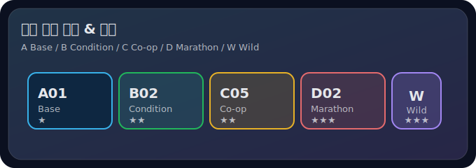

# CardDeck.md
# 🃏 카드 덱 v3.0 (총 42장)
> 이 문서는 **운영진용(또는 선택 종료 후 공개)**을 권장합니다.  
> 카드 뒷면에는 보통 `코드 + 타입 + 난이도(★)`만 표기하고, 앞면(실제 미션)은 선택 후 공개하면 퍼즐성이 살아납니다.

---

## 카드 뒷면 예시(타입 색상/레이블)

---

## 타입 설명
- **A Base(기본)**: 러닝 1회로 단독 달성 가능(1회당 A는 1장만 체크)
- **B Condition(조건)**: 시간/날씨/환경/장비 조건(반드시 러닝과 함께, 1회당 B 1장만)
- **C Co-op(협동/밸런스 통합)**: 목요미식회/벙개/동행/도움(1회당 C 1장만)
- **D Marathon(누적/연속)**: 여러 날 누적 목표(완성되는 러닝에서 체크, 총 2칸 제한에 포함)
- **W Wild**: (기본) 중앙칸 전용, (변형) 모서리 포함 / 달성 시 Wild 토큰 획득(공격/방어)

---

## 공통 조건(모든 카드)
- 카드 설명에 별도 언급이 없어도 **기본 러닝 기준**은 동일합니다.
- 조건(티어 스케일링): 페이스 7'00/km 이내 + (초보 5km+ 또는 30분+ / 중수 7km+ 또는 40분+ / 고수 10km+ 또는 50분+)
- 중수/고수 예외: **페이싱/레벨믹스 + 하위 티어 동행(그룹 티어 입력)**이면 기본 조건 예외 인정

---

# A. Base (14장)
A01 ★ 7km 이상 러닝(중수 기준)  
- 조건(티어 스케일링): 초보 5km+ / 중수 7km+ / 고수 10km+  
- 증거: 러닝앱 기록

A02 ★★ 8km 이상 러닝(중수 기준)  
- 조건(티어 스케일링): 초보 6km+ / 중수 8km+ / 고수 12km+  
- 증거: 러닝앱 기록

A03 ★★ 10km 이상 러닝(중수 기준)  
- 조건(티어 스케일링): 초보 7km+ / 중수 10km+ / 고수 15km+  
- 증거: 러닝앱 기록

A04 ★ 40분 이상 러닝(중수 기준)  
- 조건(티어 스케일링): 초보 30분+ / 중수 40분+ / 고수 50분+  
- 증거: 러닝앱 기록

A05 ★★ 60분 이상 러닝(중수 기준)  
- 조건(티어 스케일링): 초보 50분+ / 중수 60분+ / 고수 70분+  
- 증거: 러닝앱 기록

A06 ★ 워밍업 10분 + 러닝  
- 조건: 러닝 전 동적 스트레칭/워밍업 10분 수행  
- 증거: 체크리스트/짧은 사진/텍스트(자기보고)

A07 ★ 쿨다운 스트레칭 10분  
- 조건: 러닝 후 스트레칭 10분  
- 증거: 사진 또는 자기보고(간단)

A08 ★ 폼롤링/마사지 20분  
- 조건: 러닝 후 폼롤러/마사지 20분  
- 증거: 사진 또는 자기보고(간단)

A09 ★★ 보강운동 10분(하체/코어)  
- 조건: 러닝 후 스쿼트/런지/플랭크 등 10분  
- 증거: 자기보고(운동명 1줄)

A10 ★★ 첫 러닝 동행 5km  
- 조건: 러닝 처음 하는 사람과 **5km 이상 동행(티어 무관, 공통 조건 예외)**  
- 증거: 같이 뛴 러너 태그/인증

A11 ★★ 새 코스 개척  
- 조건(티어 스케일링): 이번 달 처음 가는 코스에서 러닝 + (초보 5km+ / 중수 7km+ / 고수 10km+)  
- 증거: 지도 캡처(러닝앱 경로)

A12 ★★ 빌드업(또는 네거티브 스플릿) 러닝  
- 조건(티어 스케일링): 총 러닝시간 (초보 30분+ / 중수 40분+ / 고수 50분+) + 마지막 10분 평균페이스가 첫 10분보다 빠름  
- 증거: 스플릿/랩 캡처(가능하면)

A13 ★★ 러닝 드릴 5분  
- 조건: 기본 러닝(A01 기준) + 스킵/런지워크/러닝폼 드릴 등 5분  
- 증거: 자기보고(드릴명 1줄)

A14 ★ 인스타 공유  
- 조건: 러닝 기록 인스타 공유 + 코멘트 1줄  
- 증거: 게시물/캡처

---

# B. Condition (10장)
B01 ★ 야간 러닝  
- 조건: 시작 시간이 **22:00 이후**(로컬 시간)  
- 증거: 앱 시작시간 캡처

B02 ★★ 새벽 러닝  
- 조건: 시작 시간이 06:00 이전  
- 증거: 앱 시작시간 캡처

B03 ★★ 영하 러닝  
- 조건: 기온 0°C 이하  
- 증거: 날씨앱 캡처(시간대 표시 권장)

B04 ★★ 비/눈 러닝(안전 우선)  
- 조건: 비 또는 눈이 오는 날(또는 직후 노면 젖음)  
- 증거: 날씨앱/현장 사진

B05 ★ 주말 러닝  
- 조건: 토/일 수행  
- 증거: 날짜 캡처

B06 ★★ 한파/강풍 러닝(안전 우선)  
- 조건: 체감 -5°C 이하 또는 풍속 6m/s 이상 중 하나  
- 증거: 날씨앱 캡처

B07 ★★ 언덕 포함 러닝  
- 조건: 고도상승 100m+ 또는 언덕 반복 3회  
- 증거: 고도 그래프/지도

B08 ★ 트랙 러닝  
- 조건: 400m 트랙에서 러닝(일부라도 OK)  
- 증거: 트랙 사진/지도

B09 ★ 실내 러닝(트레드밀)  
- 조건: 트레드밀 러닝  
- 증거: 기기/앱 기록

B10 ★ 반사/라이트 장비 착용 러닝  
- 조건: 반사띠/라이트/헤드랜턴 등 착용(겨울 안전)  
- 증거: 착용 사진

---

# C. Co-op / Balance (9장)
C01 ★ 벙개 러닝 참여  
- 조건: 2인 이상 벙개에 참여  
- 증거: 단톡 초대/모집 캡처 + 러닝 인증(태그 권장)

C02 ★★ 벙개 러닝 개최(호스트)  
- 조건: 직접 벙개 개설 + 2인 이상 참여 성사  
- 증거: 모집글 캡처 + 참여자 인증

C03 ★ 페어 러닝(2인 동행)  
- 조건: 2인이 같은 시간대 20분+ 함께 러닝  
- 증거: 사진/태그/경로 유사 캡처

C04 ★★ 같은 날 3명 이상 러닝 인증  
- 조건: 같은 날짜에 크루원 3명+ 러닝 인증  
- 증거: 단톡 인증 모음 캡처(운영진 확인 가능)

C05 ★ 목요미식회 1회 참석  
- 조건: 공식 목요미식회 참여 1회  
- 증거: 단체사진/운영진 출석 체크

C06 ★★ 느린 러너 페이스메이킹  
- 조건: “나보다 느린 러너”와 30분+ 동행(도움 주기)  
- 증거: 함께 인증 + 대상자 태그(권장)

C07 ★★ 레벨 믹스 러닝  
- 조건: 서로 다른 티어(초/중/고) 2인+ 함께 러닝  
- 증거: 태그/사진

C08 ★ 회복 페이스 유지 수다러닝
- 조건: 대화 가능한 페이스(6:30 km/h)로 2인 이상 1시간  
- 증거: 자기보고(짧게)

C09 ★ 러닝 후 함께 스트레칭/커피  
- 조건: 러닝 후 2인+ 함께 스트레칭 또는 커피/식사  
- 증거: 사진

---

# D. Marathon (5장)
D01 ★★★ 5일 연속 러닝  
- 조건: 5일 연속(달력 기준) 러닝 기록(각 20분+ 권장)  
- 증거: 주간 캘린더/활동 리스트 캡처

D02 ★★★ 피날레 스퍼트(마지막 주 6회 러닝)  
- 조건: 마지막 주(운영진 공지 기간 7일) 러닝 6회  
- 증거: 해당 주 활동 캡처

D03 ★★★ 누적 거리 목표(티어별)  
- 초보: 80km / 중수: 150km / 고수: 250km  
- 증거: 누적 거리 캡처(앱 통계)

D04 ★★★ 작심삼일(3일 연속 러닝)  
- 조건: 3일 연속 러닝 기록(각 20분+ 권장)  
- 증거: 주간 캘린더/활동 리스트 캡처

D05 ★★★ 퐁당퐁당(격일 러닝)  
- 조건: 연속 4일 중 2회 러닝(런-휴-런-휴)  
- 증거: 주간 캘린더/활동 리스트 캡처

---

# W. Wild (4장) — 달성 시 Wild 토큰 1개
W01 ★★★ 목요미식회 3회 참석  
- 조건: 기간 내 목요미식회 3회  
- 증거: 운영진 출석/인증

W02 ★★★ 벙개 메이커  
- 조건: 벙개 2회 “개설” + 매회 3인 이상 러닝 성사  
- 증거: 모집글/참여자 인증

W03 ★★★ 페이스메이커 3회  
- 조건: 느린 러너 동행(도움 러닝) 3회(서로 다른 날짜)  
- 증거: 태그/사진(권장)

W04 ★★★ 주간 6회 러닝(월~일)  
- 조건: 기간 중 아무 주(월~일)에서 러닝 6회 달성  
- 증거: 주간 활동 캡처

> Wild 토큰 사용 규칙은 RuleBook의 Seal/Shield 참고
